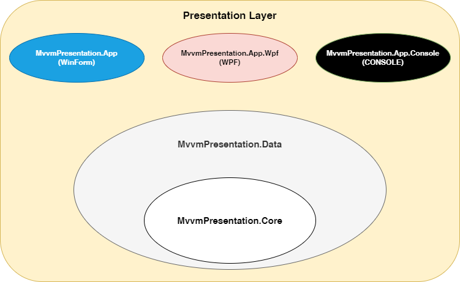
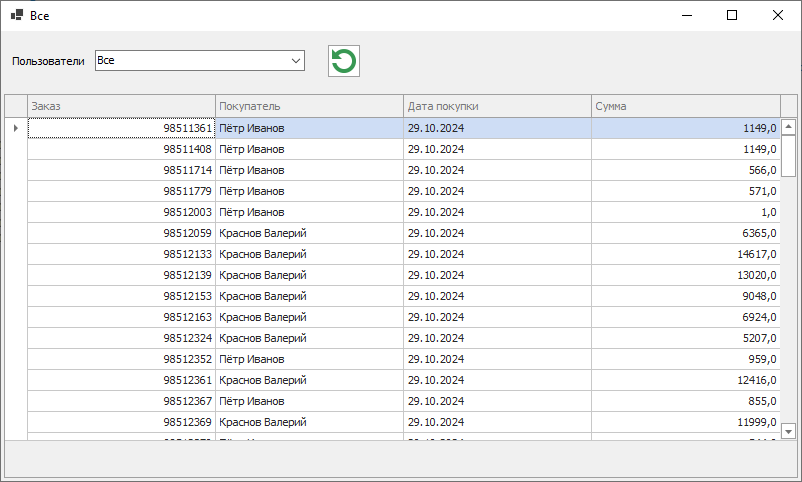

# MvvmPresentation
Демонстрация развязки бизнес-логики и представления. Решение содержит несколько фреймворков представления, которые могут работать с единым кодом бизнес логики

## Архитектура решения

- MvvmPresentation.Core - Слой бизнес логики, содержит модели представления и интерфейсы сервисов доступа  к данным (инфраструктуре)
- MvvmPresentation.Data - инфраструктурный слой. Содержит реализации сервисов доступа к бизнес данным
- Слой представления, содержит графические представления для пользовательского интерфейса. В рамках текущей демонстрации решение содержит три графический фреймворка:
   - MvvmPresentation.App - WinForm
   - MvvmPresentation.App.Wpf - WPF
   - MvvmPresentation.App.Console - текстовая консоль

### Функционал демо-приложения
Приложение выводит список заказов пользователей и имеет следующий функционал:
- Отображение индикации при загрузке данных 
- Фильтрация списка заказов по выбранному пользователю
- Полная перезагрузка данных по заказам

